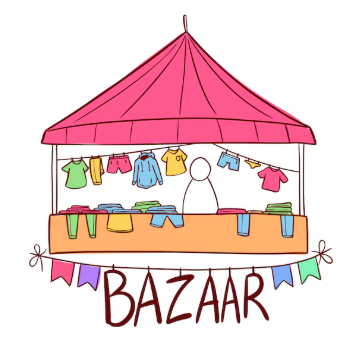

<!-- ================= HEADER ANIMADO (SVG, liviano) ================= -->

<!-- ================= TÍTULO CON TYPING SVG (endpoint activo) ================= -->
<h3 align="center">
  
</h3>

Construyendo soluciones escalables, desde la base de datos hasta la interfaz.

 

<!-- ================= BADGES PRINCIPALES (profesional primero) ================= -->

  
  
  
  

<!-- ================= BADGES PERSONALES (secundario) ================= -->

  
  
  

---

### 👨‍💻 Sobre mí

- 🎓 **Técnico Universitario en Programación** — recibido.
- 💻 Desarrollador **Full Stack** especializado en el ecosistema **MERN** y robustez backend con **Java**.
- 🏗️ Fuerte enfoque en el diseño de arquitecturas limpias, **principios SOLID** y patrones de diseño (State, Composite, etc.).
- 🗄️ Experiencia gestionando bases de datos relacionales y NoSQL, modelado y pipelines de agregación.
- 🚀 Actualmente colaborando e impulsando proyectos en [Glemn Software](https://www.instagram.com/glemnsoftware).

---

### 🛠️ Ecosistema Técnico

  

---

## 📊 Estadísticas y Contribuciones

  <!-- Estadísticas generales de GitHub -->
  
  
  <!-- Lenguajes más utilizados -->
  

 

---

### 🚀 Proyectos Destacados

| 📈 App Finanzas | 🛒 Bazar Maravillas |
| :---: | :---: |
|  |  |
| Gestión de finanzas personales y seguimiento. | Plataforma de comercio/bazar con interfaz dinámica. |
| [**🔗 Visitar Web**](https://app-finanzas-sepia.vercel.app) | [**🔗 Visitar Web**](https://bazar-maravillas.vercel.app) |

> 💡 **Nota:** explorá todos mis repositorios (incluyendo sistemas de autenticación en Java, arquitecturas de software y más) en [**mi perfil de GitHub**](https://github.com/NahuelGodoy21?tab=repositories).

---

### 📬 Contacto

¿Tenés un proyecto en mente o querés charlar sobre arquitectura de software? Escribime por cualquiera de estos medios:

  
  

<!-- ================= FOOTER ANIMADO (SVG, liviano) ================= -->

